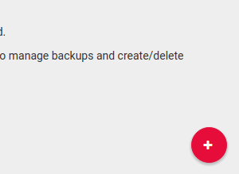
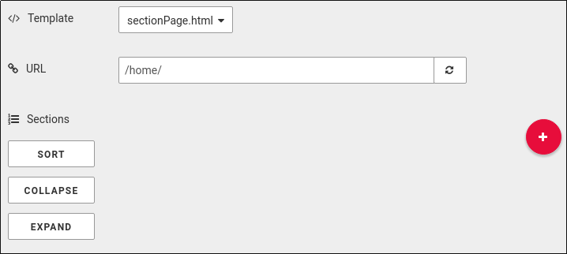
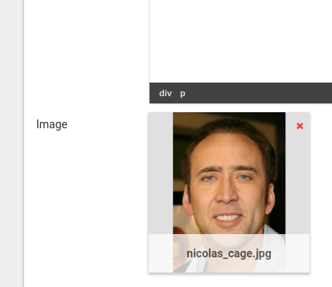
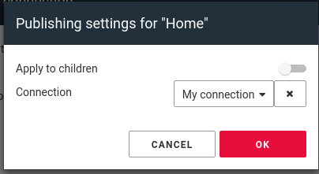

## Prerequisites
For this example, we'll be using express and the [HashBrown node.js driver](https://github.com/Putaitu/hashbrown-cms-node-driver)
We need the `body-parser` package to allow pushing content changes, as they are consumed via a REST API.  
In this example, we're using `pug` for templating, but that's up to you.

Make sure you have the latest stable version of HashBrown, and that it's running

When you've cloned this repo, install the dependencies and start the server:
```bash
$ npm install
$ node index.js
```

## Create the project
- Create a new project in the dashboard and call it "node.js example"


## Create the Connection
- In the "Connections" pane, right click and create a new Connection of type "HashBrown Driver"
- Give it a name, like "My connection"
- Set the URL to `http://localhost:8000`
- Set the token to `3340e90b6135a7e2bec659061778ab7b1ddba9f0`
- Click "save"
- Flip the 2 switches "is Template provider" and "is Media Provider"
- You should see the Templates pop up in the "Templates" pane

## Create the Schemas
### Section Schema
- In the "Schemas" pane, right click and create a new child Schema under the "Struct" type

- Type "Section" into the name field
- Pick a fancy icon
- You don't need to set the field editor, since it's determined by the parent Schema ("Struct", in this case)
- Use this config:
```json
{
    "struct": {
        "template": {
            "label": "Template",
            "schemaId": "templateReference",
            "config": {
                "type": "partial",
                "allowedTemplates": ["section"]
            }
        },
        "image": {
            "label": "Image",
            "schemaId": "mediaReference"
        },
        "text": {
            "label": "Text",
            "schemaId": "richText"
        }
    }
}
- Click "save"

### Section Page Schema
- Create a new Schema as a child of the "Page" Schema and name it "Section Page"

- Use these fields:
```json
{
    "template": {
        "label": "Template",
        "schemaId": "templateReference",
        "tabId": "content",
        "config": {
            "allowedTemplates": ["sectionPage"],
            "type": "page"
        }
    },
    "sections": {
        "label": "Sections",
        "tabId": "content",
        "schemaId": "array",
        "config": {
            "allowedSchemas": ["THE_ID_OF_YOUR_SECTION_SCHEMA"]
        }
    }
}
```
- To get the id of your "Section" Schema, just right click it and select "copy id"
- Click "save"

## Create the Content
- In the "Content" pane, create a new Content node

- Pick the "section Page" Schema and click "OK"
- Give it a name, like "Home"

## Create the sections
- In the Content editor, add a new section with the "+" button

- Type some text into the text editor (note that you can use WYSIWYG, markdown and HTML)
- Click the image field to upload an image

- Click "save"

## Publish the Content
As you can configure multiple Connections, you need to specify which one your Content nodes will be using.
- Right click your Content node in the "Content" pane and pick "Settings > Publishing"
- Select the Connection you created and slick "OK"

- Note that the Content editor now has an "& publish" dropdown next to the "Save" button
- Click "Save & publish"
- Click "View"

## And that's it!
HashBrown is now submitting Media and Content to your website
